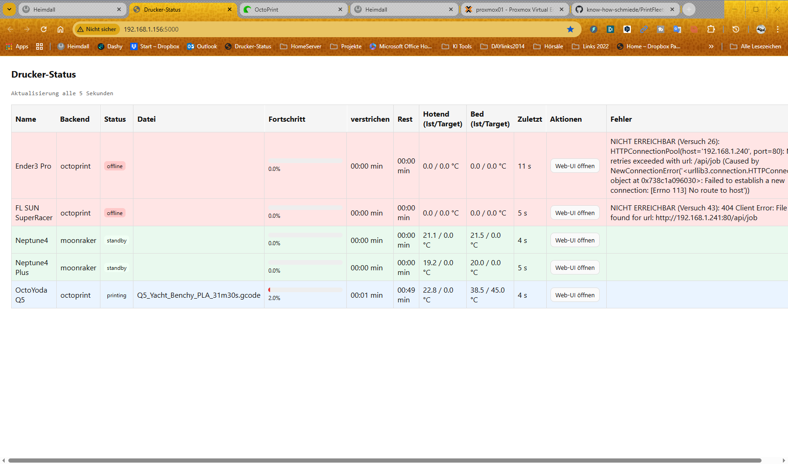
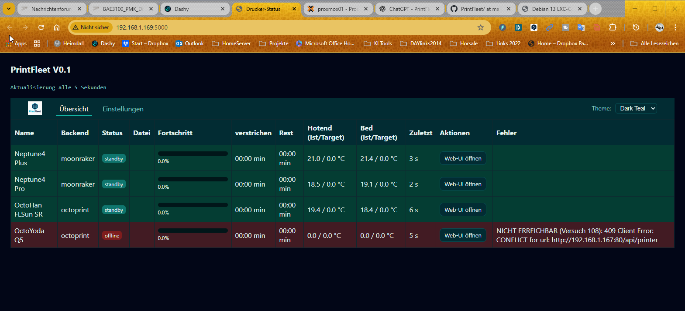

# Timeline von PrintFleet
## V0 - erster Test auf Debian13 LXC-Container
### 11.-12. November 2025:
erste Test`s mit dem ursprünglichen Script, installiert auf einem Debian13 LXC-Container in einem Proxmox-Cluster. Externes Konfig-File, Buttons für die direkte Bedienung von Klipper und OctoPrint. Hintergründe der Zeilen werden anhand des Status eingefärbt (Rot = Fehler, Blau = Druck aktiv, Grün = Drucker im Standby), Deployment per GitHub funktioniert nur teilweise, Repro clonen funktioniert, Abhängige Bibliotheken automatisch installieren noch nicht.

### 15.-16. November 2025:
Migration von Konfig-File auf SQLite-Datenbank Lösung. Verwaltung der Datenbank noch über externes Tool (z.B. DBBrowser). Formulare über Webserver in Planung. Anleitung für Installation auf LXC-Container unter Proxmox erstellt (Umständlich, aber für erste Test`s ausreichend)

### 17. November 2025:
Installation auf Proxmox-CLuster im FutureSpace Lab. Drucker-Daten per CSV-Export aus DBBrowser gebackupt.
CSS-Theme`s eingebaut. Anleitung um Git-Pull für Update aus Server ergänzt
